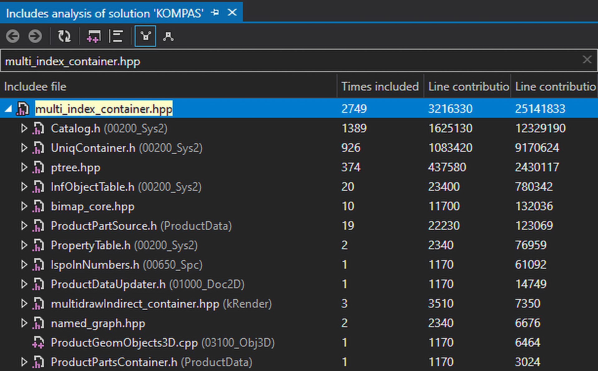
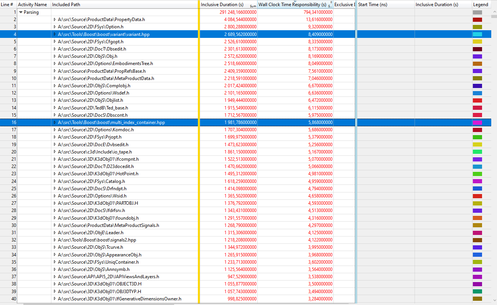

---

title: "Ускорение сборки КОМПАС-3D с помощью PCH"
author: "Александр Тулуп"
# theme : "serif"
theme : "league"
highlightTheme : "default"

transition : "slide"
logoImg: "img/logo.png"
controls: false
enableMenu: false
enableChalkboard: false
enableTitleFooter: false
---

#### Ускорение сборки КОМПАС-3D с помощью PCH
<small>Александр Тулуп<br>tulup@ascon.ru</small>

---

### Проблема


---

### Что есть ?
- ~3 миллиона строк
- ~4500 .cpp & ~4000 .h
- 55 проектов
- boost, stl, winapi

---

### Поиск узких мест
- Resharper C++ Analyze Includes 
- [C++ Build Insights](https://devblogs.microsoft.com/cppblog/finding-build-bottlenecks-with-cpp-build-insights/)

---

### Resharper C++ Analyze Includes


---

### C++ Build Insights
- Visual Studio 2019
- [latest Windows ADK](https://docs.microsoft.com/en-us/windows-hardware/get-started/adk-install)
- `perf_msvcbuildinsights.dll` -> WPA directory
- `perfcore.ini` add `perf_msvcbuildinsights.dll`

---

### C++ Build Insights
- `vcperf /start MySessionName`
- compile your project
- `vcperf /stop MySessionName outputFile.etl`

---

###### C++ Build Insights


---

###### C++ Build Insights


---

### Include What You Use (iwyu)
- удаляет лишние include
- добавляет forward declaration

---

### Include What You Use (iwyu)
- `llvm`
- `-DLLVM_ENABLE_PROJECTS="clang;clang-tools-extra"`


---

### Include What You Use (iwyu)
```
// найти лишние include
iwyu_tool -j 256 -p compile_commands.json -- -w > iwyu_res.cpp
```

```
// применить исправления
fix_includes.py < iwyu_res.cpp
```

---

### PCH
- `vcperf /start MySessionName`
- compile your project
- `vcperf /stopnoanalyze MySessionName outputFile.etl`

---

### PCH


---

### PCH


---

### Результаты


---

### Результаты
<!-- ###### https://t.ly/sieO -->


---

### Результаты


---

### Спасибо!

---

### Ссылки
- [Include What You Use](https://github.com/include-what-you-use/include-what-you-use)
- [Finding build bottlenecks with C++ Build Insights](https://devblogs.microsoft.com/cppblog/finding-build-bottlenecks-with-cpp-build-insights/)